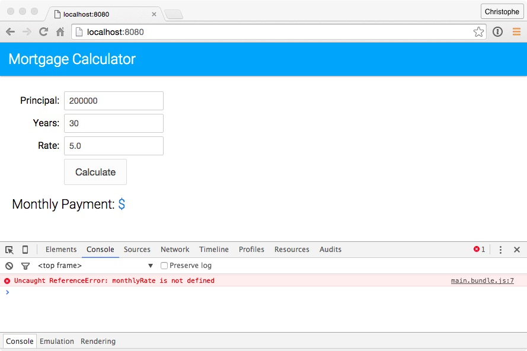

# 2. Using ```let``` Variables

ECMAScript 6 introduces a new keyword to declare variables: ```let```. Unlike variables declared with ```var``` that are function-scoped, variables declared with ```let``` are block-scoped: they only exist in the block they are defined in. 

In this unit, you modify the application to use ```let``` variables. 


## Steps 

1. In your code editor, open `js/main.js` and examine the ```calculateMonthlyPayment``` function:

	```
	var calculateMonthlyPayment = function(principal, years, rate) {
		if (rate) {
			var monthlyRate = rate / 100 / 12;
		}
		var monthlyPayment = principal * monthlyRate / 
		                     (1 - (Math.pow(1/(1 + monthlyRate), years * 12)));
		return monthlyPayment;
	};
	```

	Notice that on line 5, the `monthlyRate` variable is available even though it was declared within the `if` block. This is because variables declared with `var` are **function-scoped**, and not **block-scoped**. This way of declaring and using variables is definitely not a best practice: it is used here to illustrate the difference between function-scoped and block-scoped variables.
	
	> To keep the code simple and readable, the field validation used in this sample application is intentionally simplistic and incomplete.	

1. Replace all the occurrences of ```var``` with ```let```. **Don't change anything else yet**. 

	> main.js now includes ECMAScript 6 code and will no longer work in ECMAScript 5 browsers.   

1. On the command line, type the following command to run the **babel** script and compile `main.js` to ECMAScript 5:

	```
    npm run babel
	```

1. Open a browser, access [http://localhost:8080](http://localhost:8080), and click the **Calculate** button: **it doesn't work**. Open the developer console. You should see a message similar to this:
	
	
	
	
	This is because unlike ```var``` variables which are **function-scoped**, ```let``` variables are **block-scoped**: they only exist in the block they are defined in. 

1. In `main.js`, modify the ```calculateMonthlyPayment``` function as follows:

    ```
    let calculateMonthlyPayment = function(principal, years, rate) {
        let monthlyRate = 0;
        if (rate) {
            monthlyRate = rate / 100 / 12;
        }
        let monthlyPayment = principal * monthlyRate / 
                             (1 - (Math.pow(1/(1 + monthlyRate), years * 12)));
        return monthlyPayment;
    };
    ```

1. On the command line, type the following command to rebuild the application:

	```
    npm run babel
	```

1. Open a browser, access [http://localhost:8080](http://localhost:8080), and click the **Calculate** button: you should now see the monthly payment.

	> If you are still seeing the error, make sure you clear your browser's cache and refresh the page.


## Additional Resources

- [MDN let variables](https://developer.mozilla.org/en-US/docs/Web/JavaScript/Reference/Statements/let)


<div class="row" style="margin-top:40px;">
<div class="col-sm-12">
<a href="ecmascript6-setup-babel.html" class="btn btn-default"><i class="glyphicon glyphicon-chevron-left"></i> Previous</a>
<a href="ecmascript6-destructuring.html" class="btn btn-default pull-right">Next <i class="glyphicon glyphicon-chevron-right"></i></a>
</div>
</div>
