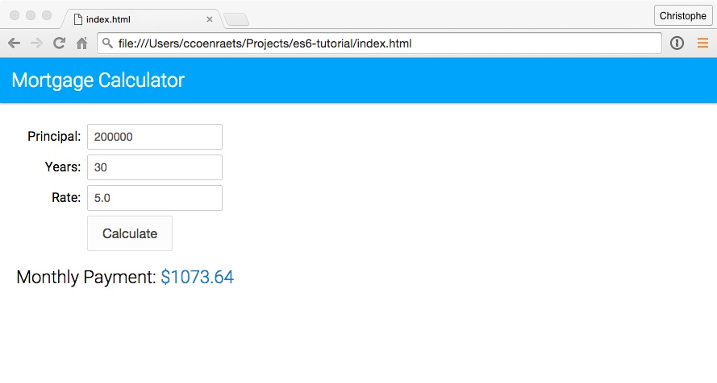
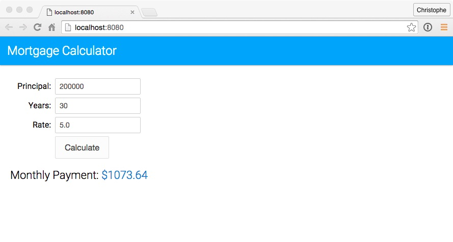

# 1. Setting Up a Babel Project

Current browsers don't support all the new ECMAScript 6 (aka ECMAScript 2015) features yet (see [comptability table](http://kangax.github.io/compat-table/es6/)). You need to use a compiler (transpiler) to transform your ECMAScript 6 code to ECMAScript 5 compatible code. Although there are other options, [Babel](http://babeljs.io/) has become the de-facto standard to compile  ECMAScript 6 applications to a version of ECMAScript that can run in current browsers. Babel can also compile other versions of ECMAScript as well as React's JSX, but that is beyond the scope of this tutorial.

In this unit, you set up a development environment to develop and run an ECMAScript 6 application using Babel.

## Step 1: Install the Sample Application

1. Clone the [es6-tutorial](https://github.com/ccoenraets/es6-tutorial/) repository that includes an ECMAScript 5 version of the mortgage application we use in this tutorial:

	```
	git clone https://github.com/ccoenraets/es6-tutorial
	```

	> Alternatively, you can just download and unzip [this file](https://github.com/ccoenraets/es6-tutorial/archive/master.zip) instead of cloning the repository.

1. Open `index.html` in your browser and click the **Calculate** button.

    


## Step 2: Set Up Babel

As you just saw, the current version of the application runs in current browsers without compilation: it is written in pure ECMAScript 5. In this section, we set up Babel so that we can start using ECMAScript 6 features in the next unit.

1. Open a command prompt, and navigate (`cd`) to the `es6-tutorial` directory.

1. Type the following command to create a `package.json` file:

    ```
    npm init
    ```

    Press the **Return** key in response to all the questions to accept the default values.
     
1. Type the following command to install the **babel-cli** and **babel-core** modules:

	```
	npm install babel-cli babel-core --save-dev
	```
	
	> There are different ways to install and run Babel. For example, you could also install Babel globally and run it from the command line. Refer to the [Babel](http://babeljs.io/docs/setup/) documentation for more information.


1. Type the following command to install the **ECMAScript 2015 preset**:
	
	```
	npm install babel-preset-es2015 --save-dev
	```
	
	> In Babel 6, every transformer is a plugin that can be installed separately. A preset is a group of related plugins. Using a preset, you don't have to install and update dozens of plugins individually.
	

1. Install [http-server](https://github.com/indexzero/http-server) in your project. **http-server** is a lightweight web server we use to run the application locally during development. 

	```
	npm install http-server --save-dev
	```

	> We are using a local web server because some parts of this tutorial require the application to be loaded using the **http** protocol and will not work if loaded using the **file** protocol.

1. Open `package.json` in your favorite code editor. In the `scripts` section, remove the **test** script, and add two new scripts: a script named **babel** that compiles main.js to a version of ECMAScript that can run in current browsers, and a script named **start** that starts the local web server. The `scripts` section should now look like this:

	```
	"scripts": {
        "babel": "babel js/main.js -o build/main.bundle.js --presets es2015",
		"start": "http-server"
	},
	```

1. In the `es6-tutorial` directory, create a `build` directory to host the compiled version of the application.
	
## Step 3: Build and Run	


1. On the command line, make sure you are in the `es6-tutorial` directory, and type the following command to run the **babel** script and compile main.js:

	```
	 npm run babel
	```

1. Open **index.html** in your code editor, and modify the ```<script>``` tag as follows to load `build/main.bundle.js`, the compiled version of `js/main.js`:

	```
	<script src="build/main.bundle.js"></script>
	```

1. Open a new command prompt. Navigate (`cd`) to the `es6-tutorial` directory, and type the following command to start http-server:

	```
	npm start
	```

	If port 8080 is already in use on your computer, modify the **start** script in `package.json` and specify a port that is available on your computer. For example:

	```
	"scripts": {
        "babel": "babel js/main.js -o build/main.bundle.js",
	    "start": "http-server -p 9000"
	},
	```

1. Open a browser and access [http://localhost:8080](http://localhost:8080)

1. Click the **Calculate** button to calculate the monthly payment for the mortgage.

	
	
1. Open `build/main.bundle.js` in your code editor and notice that the generated code is virtually identical to the source code (`js/main.js`). This is because the current code in main.js doesn't include any ECMAScript 6 feature. With this setup in place, we are now ready to start using ECMAScript 6 features in the next unit. 


## Additional Resources

- [Babel](http://babeljs.io/) 
- [ES6 compatibility table](https://kangax.github.io/compat-table/es6/)
- [http-server repo](https://github.com/indexzero/http-server)

<div class="row" style="margin-top:40px;">
<div class="col-sm-12">
<a href="index.html" class="btn btn-default"><i class="glyphicon glyphicon-chevron-left"></i> Previous</a>
<a href="ecmascript6-let.html" class="btn btn-default pull-right">Next <i class="glyphicon glyphicon-chevron-right"></i></a>
</div>
</div>
