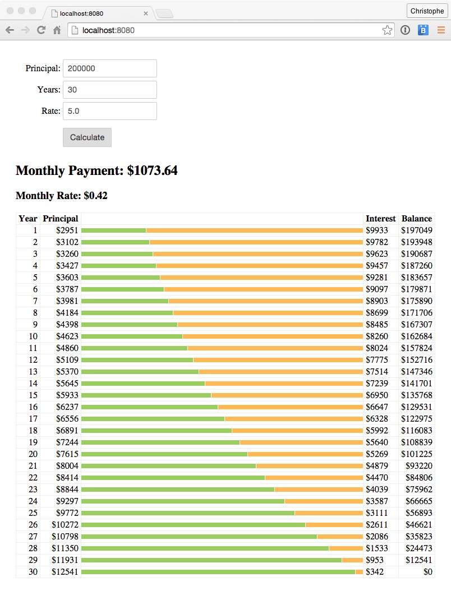

# Unit 5: Template Strings

In ECMAScript 6, template strings are single or multi-line string literals defined using the \` (back-tick) character and allowing embedded expressions defined inside ```${ }```. 

In this unit, you use a template string to display the amortization table.

## Steps
	 
1. In `index.html`, add the following HTML fragment after the ```<h3>``` block (monthly rate):
 
    ```
    <table>
        <thead>
        	<tr>
				<th>Year</th>
				<th>Principal</th>
				<th class="stretch"></th>
				<th>Interest</th>
				<th>Balance</th>
        	</tr>
        </thead>
        <tbody id="amortization"></tbody>
    </table>
    ```
 
1. In `main.js`, add the following code at the end of the **calcBtn** click event handler:  	 

    ```
	let html = "";
	amortization.forEach((year, index) => html += `
		<tr>
			<td>${index + 1}</td>
			<td class="currency">${Math.round(year.principalY)}</td> 
			<td class="stretch">
				<div class="flex">
					<div class="bar principal" 
						 style="flex:${year.principalY};-webkit-flex:${year.principalY}">
					</div>
					<div class="bar interest" 
						 style="flex:${year.interestY};-webkit-flex:${year.interestY}">
					</div>
				</div>
			</td>
			<td class="currency left">${Math.round(year.interestY)}</td> 
			<td class="currency">${Math.round(year.balance)}</td>
		</tr>
	`);
	document.getElementById("amortization").innerHTML = html;
	```
	
1. On the command line, type the following command to rebuild the application:
    
    ```
    npm run babel
    ```

1. Open a browser, access [http://localhost:8080](http://localhost:8080), and click the **Calculate** button.

    


## Additional Resources:

- [MDN: Template strings](https://developer.mozilla.org/en-US/docs/Web/JavaScript/Reference/template_strings)
- [2ality: HTML templating with ES6 template strings](http://www.2ality.com/2015/01/template-strings-html.html)


<div class="row" style="margin-top:40px;">
<div class="col-sm-12">
<a href="ecmascript-arrow-functions.html" class="btn btn-default"><i class="glyphicon glyphicon-chevron-left"></i> Previous</a>
<a href="ecmascript-modules.html" class="btn btn-default pull-right">Next <i class="glyphicon glyphicon-chevron-right"></i></a>
</div>
</div>

