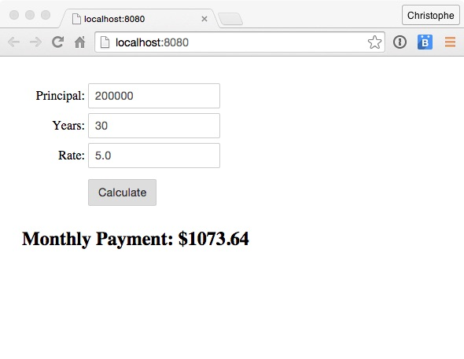

# Unit 1: Set Up Your Environment

In this unit you set up a local development environment to run the ECMAScript 5 version of the application.

## Steps

1. Clone the **es6-tutorial** repository:

	```
	git clone https://github.com/ccoenraets/es6-tutorial
	```

	... or download and unzip [this](https://github.com/ccoenraets/es6-tutorial/archive/master.zip) file

1. Open a command prompt, and navigate (cd) to the **es6-tutorial** directory.

1. Install **http-server** in your project. **http-server** is a lightweight web server used to run your app during development. 

	```
	npm install http-server --save-dev
	```

	> Some parts of this tutorial require the application to be loaded using the http protocol and will not work if loaded using the file protocol.

1. Using your favorite code editor, edit **package.json**. In the **scripts** section, add a **start** script (right before the **test** script) to start http-server using npm. The **scripts** section of package.json should now look like this:

	```
	"scripts": {
		"start": "http-server",
		"test": "echo \"Error: no test specified\" && exit 1"
	},
	```

1. Start the web server. On the command line, make sure you are in the **es6-tutorial** directory and type the following command:

	```
	npm start
	```

	If port 8080 is already in use on your system, modify the start script in package.json and specify a port that is available on your system. For example:

	```
	"scripts": {
	    "start": "http-server -p 9000",
		"test": "echo \"Error: no test specified\" && exit 1"
	},
	```

1. Open a browser and access [http://localhost:8080](http://localhost:8080) to run the ECMAScript 5 version of the application.

1. Click the **Calculate** button to calculate the monthly payment for the mortgage.

	

1. In your code editor, open **calc.js** and examine the ```calculateMonthlyPayment``` function:

	```
	var calculateMonthlyPayment = function(principal, years, rate) {
		if (rate) {
			var monthlyRate = rate / 100 / 12;
		}
		var monthlyPayment = principal * monthlyRate / (1 - (Math.pow(1/(1 + monthlyRate), 
								years * 12)));
		return monthlyPayment;
	};
	```

	Notice that on line 5, the **monthlyRate** variable is available even though it was declared within the ```if``` block. This is because variables declared with **var** are **function-scoped**, and not **block-scoped**. This way of declaring and using variables is definitely not a best practice: it is used here to illustrate the difference between function-scoped and block-scoped variables. More on this in the next unit.
	
	> To keep the code simple and readable, the field validation used in this sample application is intentionally simplistic and imcomplete.	

## Additional Resources

- [http-server repo](https://github.com/indexzero/http-server)

<div class="row" style="margin-top:40px;">
<div class="col-sm-12">
<a href="index.html" class="btn btn-default"><i class="glyphicon glyphicon-chevron-left"></i> Previous</a>
<a href="ecmascript-let.html" class="btn btn-default pull-right">Next <i class="glyphicon glyphicon-chevron-right"></i></a>
</div>
</div>
